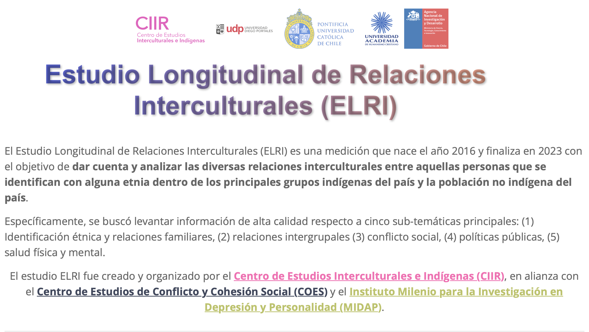

# ShinyApp Estudio Longitudinal de Relaciones Interculturales

Te damos la bienvenida a la ShinyApp del Estudio Longitudinal de Relaciones Interculturales, aplicación interactiva en la que podrás conocer el trabajo realizado por estos ocho años de la encuesta.

La aplicación fue diseñada por Matías Deneken, Coordinador Ejecutivo de la Unidad de Estudios Cuantitativos del Centro CIIR.

